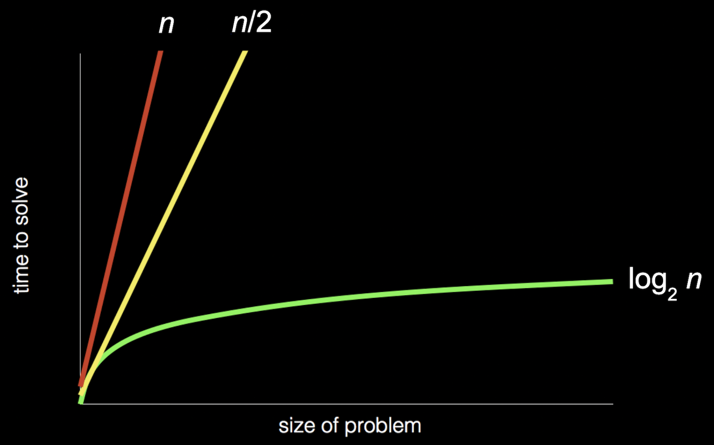

# Computer Science

### What is computer science?

It really means the study of information but it is more specifically about solving problems.

- Computer only knows 0 and 1. So it is called binary. Unary is more simpler than binary.

### Representing - Numbers (Binary, Bit, Unary)

Binary: Uses two digits, 0 and 1, representing powers of 2.

To represent 0
`0 0 0`
To represent 1
`0 0 1`
To represent 2
`0 1 0`
To represent 3
`0 1 1`
To represent 4
`1 0 0`
To represent 5
`1 0 1`
To represent 6
`1 1 0`
To represent 7
`1 1 1`
To represent 8
`1 0 0 0`

Bit: Short for "binary digit", it can be 0 or 1.

Unary: Uses one symbol, where the length of the sequence represents the number. For example, "|||" represents 3.

### Representing - Text (ASCII, Unicode)

#### ASCII (American Standard Code for Information Interchange)

- Uses 7 bits to represent 128 characters (letters, numbers, symbols)

- `H` - `01001000` - `72`
- `I` - `01001001` - `73`
- `!` - `00100001` - `33`

### Representing - Images, Sound, Video (Pixels, Resolution)

- **Pixels**: Smallest unit of a digital image; more pixels mean higher resolution.
- **Resolution**: Number of pixels in an image, affecting clarity and detail.
- **Sound**: Represented as waveforms, sampled at intervals; higher sample rates mean better quality.
- **Video**: Series of images (frames) displayed rapidly; higher frame rates and resolutions mean smoother, clearer videos.

# Algorithms

### Algorithms

Algorithms are step-by-step instructions to solve problems.

- **Linear Search**: Start from the first page and look one page at a time; correct but slow (red line).
- **Skip Search**: Flip two pages at a time; incorrect as it might miss pages (yellow line).
- **Binary Search**: Open in the middle, choose the half where the name might be, and repeat; efficient (green line).

### Pseudocode

Pseudocode is a way of expressing the logic and flow of a program or algorithm in a human-readable format, using natural language and programming constructs. It is used for planning, communicating, and documenting software logic. Pseudocode includes elements like variables, loops, conditionals, and functions, and its syntax can vary by author. The goal is clarity and conciseness while accurately describing the program's behavior.
